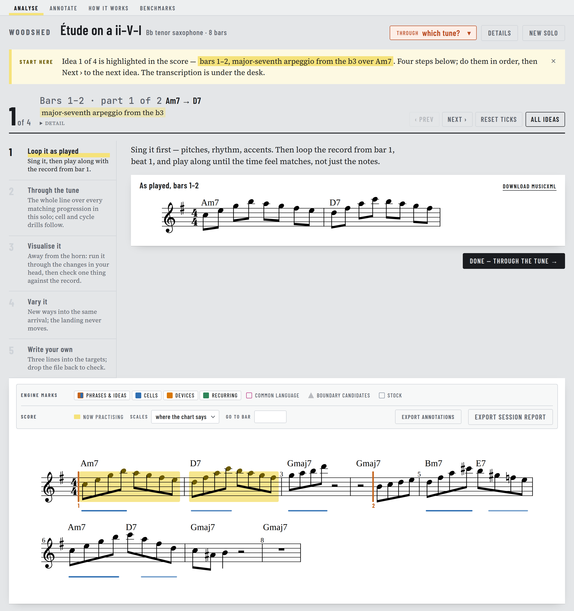
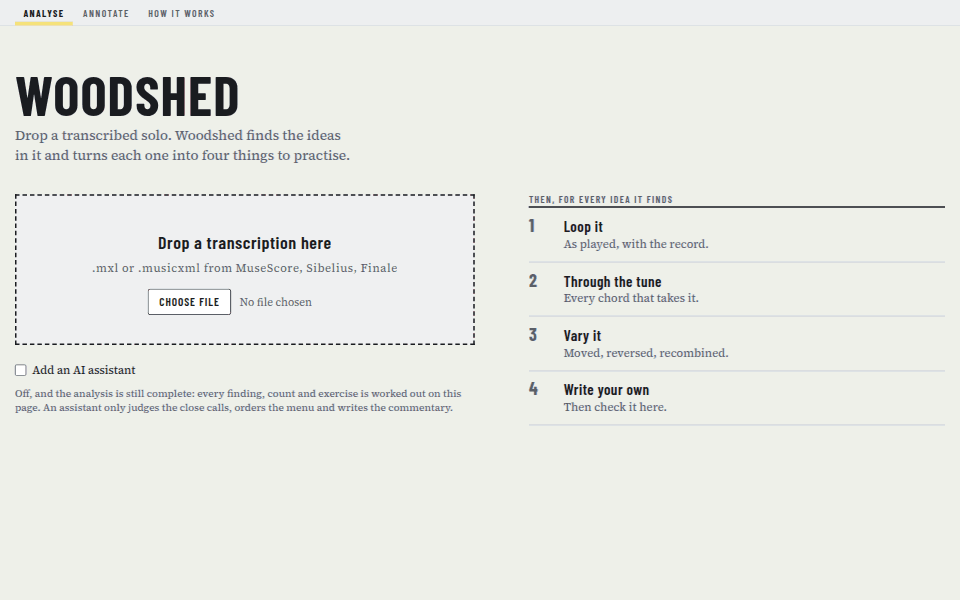

# woodshed

[](https://github.com/mkou135/woodshed/actions/workflows/ci.yml)

It reads the sheet music of a jazz solo and turns it into practice drills, the
way a teacher would. More precisely: it analyses a transcribed jazz solo and
generates exercises that drill the vocabulary it contains. Drop a `.mxl` on the
page; it segments the solo into phrases and ideas, works out what each note is
doing against the chord under it, names the figures it recognises, and turns
every idea into four things to practise — loop it, take it through the tune,
vary it, write your own.





It is one working saxophonist's tool, not a product. It is built around one
player's ear on real transcriptions, and where that ear and a corpus disagree
the disagreement is written down along with what it cost.

The score is parsed and analysed in the browser; no transcription leaves the
machine. The optional agent stage is the exception, and only if you ask for it:
the page has a key field, and a key you paste stays in that browser's
`localStorage` and is used to call the Anthropic API direct. Without one the
engine decides alone. The deployed copy is at <https://mkou135.github.io/woodshed/>.

## Running it

```bash
npm install
npm run dev        # Vite dev server; drop a .mxl or .musicxml on the page
```

Everything else is a command line onto the same engine. `npm run solo -- <file.mxl>`
prints the findings and exercises for one file; it uses the agent stage when
`ANTHROPIC_API_KEY` is set, replays recorded verdicts with `AGENT_FIXTURES=<dir>`,
and `--no-agent` forces the deterministic engine.

```bash
npm run test:run   # NOT `npm test` — that is vitest watch mode and will not exit
npm run typecheck  # both tsconfigs: src/ (no DOM) and app/
npm run build      # typecheck, then vite build into dist/
```

A fresh clone is green: the suites that need a transcription kept outside the
repo skip themselves and print one line saying so (see **The corpora**).
[`.github/workflows/ci.yml`](.github/workflows/ci.yml) runs the typecheck and
the tests on every push and pull request to `main`.

The remaining scripts (`eval:*`, `corpus:*`, `diag:wjd`, `brackets`,
`bench:bopland`, `eval:stock`, `bench`) all read material that is not in this repository — see **The
corpora** below. `npm run solo` needs only a local `.mxl`.

## How it works

Four stages, chained by `src/pipeline.ts`, each handing the next a plain data
structure: **ingest** (MusicXML → an immutable `Score`), **prepare** (inspect,
report, never edit), **analyse** (segment, contextualise, four independent
detectors, merge into ranked findings), **practice** (ideas become drillable
units with four steps each). An optional agent stage judges alongside it.

The app carries a full engine reference page, *How the engine works*, which
explains the shape of the machine — which decisions exist, in what order, and
why. For any actual value, [`docs/ENGINE_SPEC.md`](docs/ENGINE_SPEC.md) is the
source of truth.

### Evaluation

The engine is deterministic: there are no trained weights and no training step,
and the optional agent stage only ranks and names what the engine has already
found. What stands in for machine learning here is evaluation. Segmentation is
scored as phrase and idea boundaries against the Weimar Jazz Database — 456
solos, `npm run eval:wjd` — and against the owner's own annotations and
brackets (`npm run eval:owner`, `npm run brackets`); every corpus solo's counts
are pinned in [`goldens/corpus-wjd.json`](goldens/corpus-wjd.json), which
`npm run corpus:wjd` diffs on every sweep.

When the two targets disagree, the owner's ear governs and the cost is written
down. The concrete example: a logistic model fitted on the 18,015 corpus gaps
that carry a rest — the ones the weights actually decide — wanted the held-note
and leap cues at about a third of their hand-tuned weight, and beat the shipped
weights at gap level (AUC 0.895 against 0.876, best F1 86.4 against 85.7).
Through the whole segmenter the difference was noise, +0.2 on phrases and −0.5
on ideas, and on the owner's own brackets it failed: the Mintzer solo went from
12 of 13 phrase starts matched to 9. The fitted weights were rejected, and the
entry records what would reverse that — see
[DECISIONS 2026-09-02, "Fitted segmentation weights rejected"](docs/DECISIONS.md#2026-09-02--fitted-segmentation-weights-rejected-the-corpus-optimum-fails-the-owners-brackets).
The same pattern decided the chorus-start prior a week earlier: the corpus
sweep would switch it off, the owner's annotated blues keeps it, and
[DECISIONS 2026-08-27](docs/DECISIONS.md#2026-08-27--chorus-start-prior-value-wchorus-stays-at-045-against-the-corpus)
records the 1.7 phrase F1 it costs.

## If you read three files

The repository is too large to read in one sitting. These three carry the
shape of it:

- [`src/analyse/detectors/resolutions.ts`](src/analyse/detectors/resolutions.ts)
  — one complete detector, end to end: the b7 of a chord falling to the 3 of
  the chord a fourth above it. It is the only detector whose subject is a
  chord *change* rather than a note against the chord it sits on, and the only
  one allowed to cross an idea boundary, and the file says why. Its test sits
  beside it.
- [DECISIONS 2026-09-02, "Fitted segmentation weights rejected: the corpus optimum fails the owner's brackets"](docs/DECISIONS.md#2026-09-02--fitted-segmentation-weights-rejected-the-corpus-optimum-fails-the-owners-brackets)
  — the best story in the repo: a fitted model that beats the hand-tuned
  weights on the corpus, loses on the owner's brackets, and is rejected with
  the numbers, who decided, and what would reverse it.
- [`src/agent/verdicts.ts`](src/agent/verdicts.ts) — the judges-never-generates
  contract in code: strict schemas for everything the model may return, every
  one of them referencing engine objects by id, so a pitch, count or interval
  cannot ride along.

## The four files

The unusual thing about this repo is that its state lives in four documents
that are maintained continuously, not written up at the end. A session starts
by reading the spec and the tail of the ledger.

- [`docs/ENGINE_SPEC.md`](docs/ENGINE_SPEC.md) — every rule, parameter and
  formula in force, each section naming the file that implements it. **Never
  quote a parameter from memory; re-read it.** It is updated in the same commit
  as the change it describes. If the spec and the code disagree, that is a bug
  to fix now.
- [`docs/DECISIONS.md`](docs/DECISIONS.md) — append-only. Date, question,
  decision, what class of evidence supported it, who decided, and what would
  reverse it. Old entries are never edited, only superseded.
- [`docs/OPEN_QUESTIONS.md`](docs/OPEN_QUESTIONS.md) — everything unresolved,
  each with what would resolve it. An entry leaves only by becoming a decision.
- [`docs/LEDGER.md`](docs/LEDGER.md) — the running task log, including
  judgement calls taken on the owner's behalf.

`docs/HANDOFF.md` is narrative history: useful background, no longer
authoritative. `docs/superpowers/specs/` holds the design specs behind larger
changes, and is where to look for how this project argues from evidence.

## Non-negotiables

- **`src/` is DOM-free.** Only `app/` may touch the DOM. This is enforced by
  the src tsconfig carrying no DOM library — it is a compile error, not a
  convention.
- **The `Score` is immutable.** `prepare/` emits `Adjustment[]` describing what
  looks wrong and never edits, so nothing shifts underneath you silently.
- **The agent layer judges, never generates.** It may weigh engine-computed
  evidence and cast a judgement — rank, adjudicate, name, narrate — but every
  note, count and interval comes from deterministic code, and every verdict
  references engine objects by id.
- **Chord quality comes from the MusicXML `<kind>` element, never the `text`
  attribute.** Text says what the engraver typed; `<kind>` says what they
  meant. Text is a lower-confidence fallback for charts that have nothing else.
- **`fixtures/` is never modified** — tests assert its exact values.

## The corpora

Three external bodies of music inform the engine and **none of them is in this
repository or the app bundle.** They live in `~/dev/woodshed-data/` and are run
locally:

- the **Weimar Jazz Database** (ODbL) — ground truth for phrase and idea
  boundaries, and the source of the corpus-frequency table;
- the **Bopland licks** — CC BY-SA 4.0 on paper, but scraped from Bopland
  without permission by an uploader who could not license it, so treated as
  strictly local;
- the owner's own transcriptions and annotated peer solos.

Only *derived aggregate statistics* are ever committed, with an attribution
note — [`goldens/corpus-wjd.json`](goldens/corpus-wjd.json) is the worked
example: melid → engine output counts and nothing else, no titles, performers,
tunes, notes or chord symbols. Test fixtures are hand-authored rather than
quoted from a corpus. See DECISIONS 2026-08-24 "Corpus licensing".

For anyone cloning this: the corpus is absent, so `eval:wjd`, `eval:owner`,
`eval:agent`, `eval:stock`, `corpus:*`, `diag:wjd`, `brackets`, `bench:bopland` and
`bench` will not run without it. Most take paths from the environment (`WJD`, `BOPLAND`,
`PEERS_DIR`, `AGENT_FIXTURES_WJD`) if you have your own copy. The unit tests
that depend on a peer solo, or on the Blake transcription the golden checks
read, skip themselves when the file is absent and say so in one line;
`WOODSHED_BLAKE=<path>` points the Blake suites at a copy kept elsewhere
([`src/test/blake.ts`](src/test/blake.ts)).

## Verifying a change

Green tests are not evidence the output is good. The engine once passed 156
tests while ranking its best finding 9th out of 81 — the failure that the
stock penalty in the unit ranking exists to prevent.

So the check is: run the pipeline on a real solo and read what comes out.
`npm run solo` on the Seamus Blake "Hey Lock!" transcription should put "major-seventh
arpeggio from the b3" at bars 73 and 77 top of the list with the shape, target and recurring
detectors agreeing, and produce a cycle exercise whose bars all ascend. The pinned counts
and the rest of the expected result are in ENGINE_SPEC §Verification targets;
`src/pipeline.test.ts` asserts them.

## How this was built

With Claude Code, in sessions that began on 23 August 2026. The commit history
is dense enough that it is fair to ask what a person actually did here, so
this is stated plainly rather than left to be guessed.

The owner made the calls: the thesis (the findings list is a menu, not a
verdict; the annotated transcription is the product), the segmentation
corrections by ear on real transcriptions, which corpus optimum to reject and
at what cost, the licensing stance on the corpora, and the rule that the agent
layer judges and never generates. The agent wrote most of the code, and every
session starts by reading the four state files above before touching anything.
[`docs/DECISIONS.md`](docs/DECISIONS.md) is where you can see who decided what:
each entry names the decider — owner, engine, or Claude — beside the class of
evidence and what would reverse it, and
[`docs/LEDGER.md`](docs/LEDGER.md) records the judgement calls taken on the
owner's behalf so that they can be unwound.

## Layout

```
src/            engine — DOM-free, importable, the whole product
  ingest/       MusicXML and Weimar-DB parsing → Score
  prepare/      form, soloist choice, Adjustment[] — inspects, never edits
  analyse/      segmentation, note context, chord scales, the four detectors
  generate/     exercise generation from findings
  practice/     ideas → practice units, their four steps, tunes and iReal charts
  agent/        the optional judging layer: evidence, prompts, jobs, verdicts
  render/       MusicXML out
  annotation/   boundary annotations and scoring against them
  test/         shared test support (where the Blake transcription is looked for)
app/            the DOM layer: the page, the score view, the annotation tool
scripts/        evals, corpus sweeps, the CLI runner, the annotate dev plugin
docs/           the four files, design specs, research notes, README images
fixtures/       hand-written test inputs — never modified
goldens/        committed derived statistics
annotations/    the owner's own boundary annotations, used by eval:owner
```

Tests sit beside the code they test, as `*.test.ts`.

## Licence

MIT, see [`LICENSE`](LICENSE). The derived corpus statistics in `goldens/`
carry their own attribution note; the corpora themselves are not in the repo
(see **The corpora**).

## Deployment

`.github/workflows/pages.yml` builds and publishes to GitHub Pages on every
push to `main`, and on manual dispatch. Vite is configured with `base: './'` so
the build works under the Pages subpath.

Style, if you are editing: no semicolons, single quotes, 2-space indent, ESM
with explicit `.ts` extensions in imports. `CLAUDE.md` carries the same rules in
the form the coding agent reads them.
